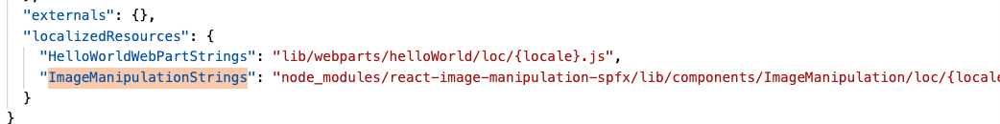

# Getting Start

## Prerequisites

[Set up Microsoft 365 tenant](https://docs.microsoft.com/en-us/sharepoint/dev/spfx/set-up-your-developer-tenant)
[Set up development environment](https://docs.microsoft.com/en-us/sharepoint/dev/spfx/set-up-your-development-environment)

## Build your own WebPart with this Libarary

After this Guide you have a running webpart [Build & deloy your first webpart](https://docs.microsoft.com/en-us/sharepoint/dev/spfx/web-parts/get-started/build-a-hello-world-web-part)

```
npm i react-image-manipulation-spfx -SE
```

After Installation you find in a new entry in `config/config.json` this solution adds `localizedResources`



To use this control go to your web part and add it to the render method
```
<ImageManipulation
  settings={this.state.settings}
  configsettings={{
    rotateButtons: [-90, -45, -30, 0, 30, 45, 90]
  }
  }
  displyMode={DisplayMode.Edit}
  settingschanged={(x) => { this.setState({ settings: x }); }}
  src={url}
/>
```

Import references:
```
import {ImageManipulation,IImageManipulationSettings} from 'react-image-manipulation-spfx'
```

Minimal State Object
```
export interface IHelloWorldState{
  settings: IImageManipulationSettings[];
}
```

add initial state to your constructor
```
constructor(props:IHelloWorldProps) {
  super(props);
  this.state ={
    settings:[]
  }
}
```

Minimal Code of your WebPart:
```
import * as React from 'react';
import { IHelloWorldProps } from './IHelloWorldProps';
import {ImageManipulation,IImageManipulationSettings} from 'react-image-manipulation-spfx'
import { DisplayMode } from '@microsoft/sp-core-library';

export interface IHelloWorldState{
  settings: IImageManipulationSettings[];
}

export default class HelloWorld extends React.Component<IHelloWorldProps, IHelloWorldState> {

  constructor(props:IHelloWorldProps) {
    super(props);
    this.state ={
      settings:[]
    }
  }
  public render(): React.ReactElement<IHelloWorldProps> {
    const url: string = 'https://media.gettyimages.com/photos/whitewater-paddlers-descend-vertical-waterfall-in-kayak-picture-id1256321293?s=2048x2048';

    return(
        <ImageManipulation
          settings={this.state.settings}
          configsettings={{
            rotateButtons: [-90, -45, -30, 0, 30, 45, 90]
          }
          }
          displyMode={DisplayMode.Edit}
          settingschanged={(x) => { this.setState({ settings: x }); }}
          src={url}
        />
    );
  }
}
```
